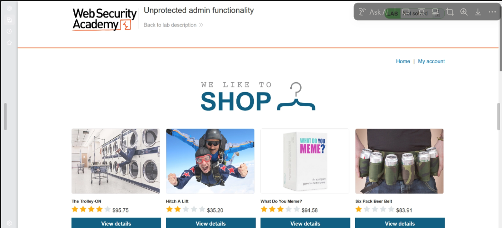
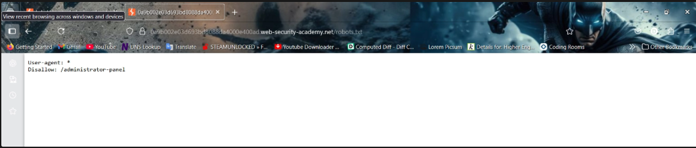
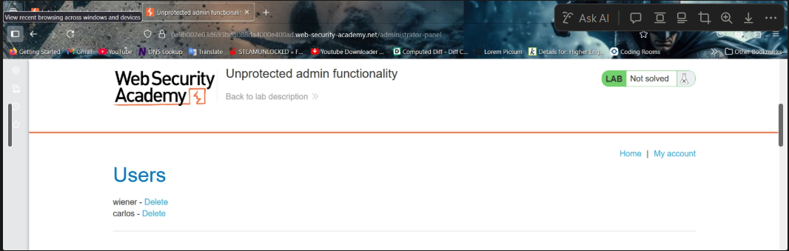
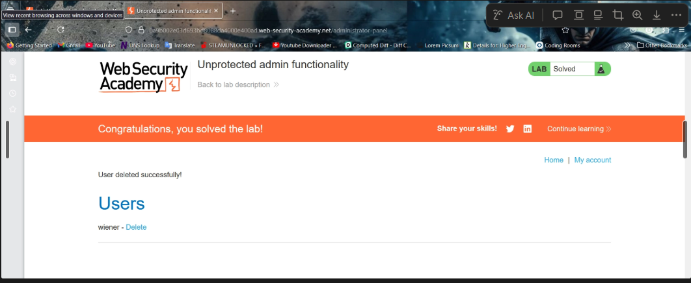

# Unprotected Admin Functionality

## Lab Overview

This lab demonstrates a critical **Broken Access Control** vulnerability where administrative functionality is exposed without proper authorization checks.

The goal of the lab is to:

- Discover the hidden administrator panel
- Access the panel without administrator privileges
- Delete the user `carlos`

This vulnerability is a classic example of **Vertical Privilege Escalation**.

---

# Understanding Access Control

Access Control is the mechanism that determines:

- Who can access specific resources
- What actions users are allowed to perform

In web applications, access control depends mainly on:

- Authentication
- Session Management
- Authorization

Improper implementation of these controls can lead to unauthorized access to sensitive functionality.

---

# Types of Access Control

## 1. Horizontal Access Control

Horizontal access control restricts users from accessing resources belonging to other users with the same privilege level.

### Example

A user should only be able to access:
- Their own account
- Their own profile
- Their own orders

and not another user's data.

---

## 2. Vertical Access Control

Vertical access control restricts access based on privilege levels.

### Example

Only administrators should have access to:
- User management
- Administrative dashboards
- Sensitive configuration settings

Normal users should not be able to access these features.

---

## 3. Context-Dependent Access Control

Access restrictions depend on the application's current state or user interaction.

### Example

A user may only cancel an order before payment confirmation.

---

# Vulnerability Explanation

In this lab, the administrator functionality exists at a hidden endpoint:

```bash
/administrator-panel
```

However, the application fails to verify whether the current user is an administrator before granting access.

As a result:
- Any user who discovers the URL can access the administrator panel
- Sensitive functionality becomes publicly accessible

This is a severe access control vulnerability.

---

# Step-by-Step Lab Solution

---

# Step 1 — Access the Lab

Opened the PortSwigger Web Security Academy lab instance.

The application homepage was displayed successfully.



---

# Step 2 — Enumerating Common Discovery Files

Administrative endpoints are sometimes unintentionally exposed through publicly accessible files such as:

- `robots.txt`
- `sitemap.xml`

To discover hidden endpoints, the `robots.txt` file was inspected.

---

# Step 3 — Inspecting robots.txt

Navigated to:

```bash
/robots.txt
```

The response contained:

```txt
User-agent: *
Disallow: /administrator-panel
```



This revealed the hidden administrator endpoint.

---

# Important Information About robots.txt

The `robots.txt` file is NOT a security mechanism.

It is only used to provide instructions to web crawlers regarding which URLs should or should not be crawled.

Attackers commonly inspect this file to identify:
- Hidden directories
- Administrative panels
- Backup files
- Sensitive endpoints

Sensitive functionality should never rely on obscurity or robots.txt protection.

---

# Crawling vs Indexing

## Crawling

Search engines visit and read page content.

## Indexing

Search engines store metadata and references to pages in their databases.

Even if crawling is restricted, a page may still appear in search results if:
- Another website links to it
- The URL is publicly discoverable

---

# Properly Preventing Indexing

To prevent indexing, developers should use:

## HTTP Header

```http
X-Robots-Tag: noindex
```

## HTML Meta Tag

```html
<meta name="robots" content="noindex">
```

However, sensitive pages should always be protected using proper authentication and authorization mechanisms.

---

# Step 4 — Accessing the Administrator Panel

After discovering the endpoint, navigated to:

```bash
/administrator-panel
```

The administrator panel was accessible without requiring administrator authentication.



This confirms that the application lacks proper server-side authorization checks.

---

# Step 5 — Deleting the User Carlos

Inside the administrator panel, deleted the user:

```txt
carlos
```

After deletion, the application displayed a success message.

---

# Lab Successfully Solved

The lab was solved successfully after deleting the target user.



---

# Vulnerability Summary

| Vulnerability | Description |
|---|---|
| Broken Access Control | Sensitive functionality accessible without authorization |
| Vertical Privilege Escalation | Normal user can access administrator functionality |
| Information Disclosure | robots.txt exposed hidden administrative endpoint |

---

# Security Risks

Improper access control vulnerabilities can lead to:

- Unauthorized administrative access
- User account compromise
- Data leakage
- Privilege escalation
- Complete application takeover

Broken Access Control is consistently ranked among the most critical web application security risks.

---

# Recommended Mitigations

## 1. Implement Proper Authorization Checks

Every sensitive endpoint must validate:
- User identity
- User role
- Required permissions

on the server side.

---

## 2. Avoid Security Through Obscurity

Hidden URLs should never be considered secure.

Even unpredictable endpoints can be discovered through:
- robots.txt
- JavaScript files
- Burp Suite analysis
- Source code inspection

---

## 3. Restrict Administrative Functionality

Administrative endpoints should only be accessible to authorized administrators.

---

## 4. Use Role-Based Access Control (RBAC)

Implement strict role validation for sensitive operations.

---

## 5. Perform Regular Security Testing

Conduct:
- Access control testing
- Authorization testing
- Privilege escalation testing

during development and deployment.

---

# Tools Used

- Burp Suite
- Browser Developer Tools
- PortSwigger Web Security Academy

---

# Key Takeaways

- Hidden endpoints are not security controls
- robots.txt should never expose sensitive paths
- Administrative functionality must always enforce server-side authorization
- Broken Access Control vulnerabilities can lead to severe compromise

---

# References

- PortSwigger Web Security Academy
- OWASP Broken Access Control
- Google robots.txt Documentation
