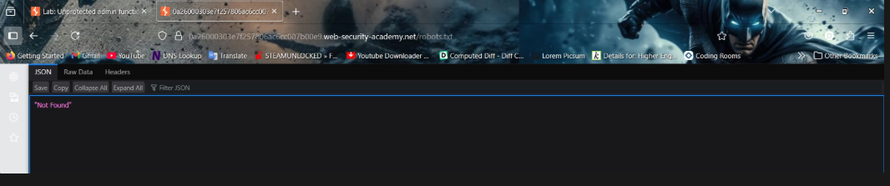
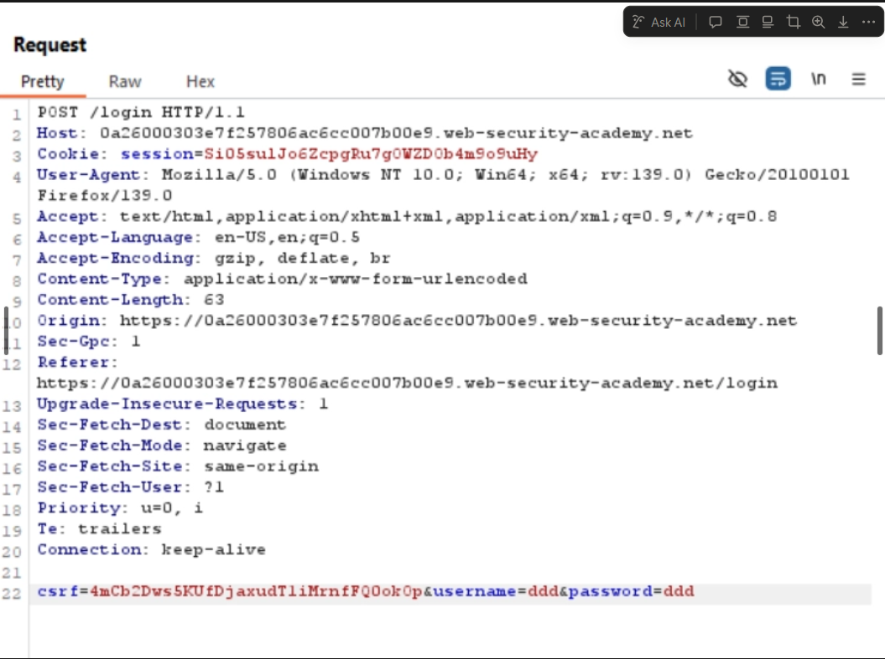
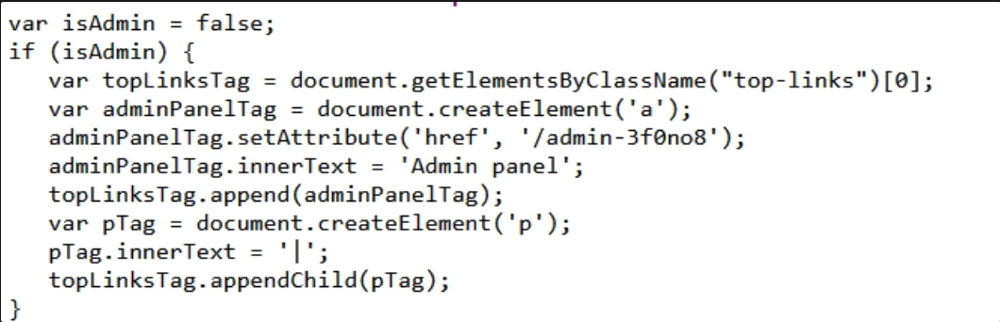
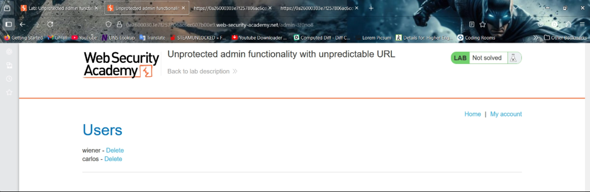
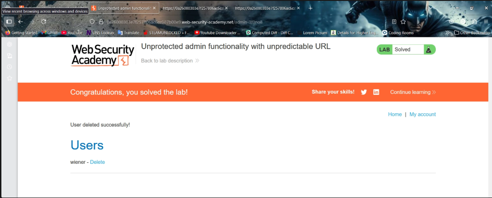

# Unprotected Admin Functionality with Unpredictable URL

## Lab Overview

This lab demonstrates a **Broken Access Control** vulnerability where administrative functionality exists at a hidden and unpredictable URL.

Although the administrator panel is not directly accessible through standard navigation, the hidden endpoint is disclosed somewhere within the application source code.

The objective of the lab is to:

- Discover the hidden administrator panel
- Access the administrator functionality
- Delete the user `carlos`

This vulnerability is another example of **Vertical Privilege Escalation** caused by improper authorization controls.

---

# Understanding the Vulnerability

Many developers incorrectly assume that hiding administrative endpoints provides security.

This approach is called:

```txt
Security Through Obscurity
```

In reality:
- Hidden endpoints can still be discovered
- Source code leaks may expose sensitive URLs
- JavaScript files often reveal hidden functionality
- Attackers commonly inspect requests and responses for hidden paths

Even if a URL is difficult to guess, it must still be protected using proper authentication and authorization checks.

---

# Step-by-Step Lab Solution

---

# Step 1 — Accessing the Lab

Opened the PortSwigger Web Security Academy lab instance.

The goal was to discover the hidden administrator endpoint and delete the user `carlos`.

---

# Step 2 — Trying Common Discovery Files

Initially attempted to discover the administrator panel through commonly exposed files such as:

```bash
/robots.txt
/sitemap.xml
```

However, no useful information was disclosed.



---

# Step 3 — Capturing Requests Using Burp Suite

To analyze application behavior more closely, requests were intercepted using :contentReference[oaicite:0]{index=0}.

The captured requests and responses were inspected for:
- Hidden parameters
- Administrative references
- Interesting comments
- Hidden endpoints



---

# Step 4 — Testing CSRF Protection

While analyzing the requests, attempted to remove the CSRF token from the request to observe application behavior.

However:
- Removing the CSRF token did not expose any useful functionality
- No privilege escalation occurred

This indicated that the vulnerability was unrelated to CSRF protection.

---

# Step 5 — Exploring the Application

Further enumeration was performed by:
- Browsing articles
- Inspecting page responses
- Reviewing application behavior

No direct administrative links were visible.

---

# Step 6 — Inspecting the Source Code

The page source code was inspected carefully.

While analyzing the source code, the hidden administrator directory was discovered.



The application disclosed the hidden administrative endpoint inside the source code.

This confirms that sensitive functionality was exposed through client-side information disclosure.

---

# Step 7 — Accessing the Hidden Administrator Panel

After discovering the hidden endpoint, navigated directly to the administrator panel.



The panel was accessible without proper authorization restrictions.

This demonstrates improper server-side access control implementation.

---

# Step 8 — Deleting the User Carlos

Inside the administrator panel:
- Deleted the user `carlos`

After deletion, the lab was successfully solved.



---

# Vulnerability Analysis

## Vulnerability Type

| Vulnerability | Description |
|---|---|
| Broken Access Control | Sensitive functionality accessible without proper authorization |
| Vertical Privilege Escalation | Normal user can access administrator functionality |
| Information Disclosure | Hidden admin endpoint exposed in source code |

---

# Why This Vulnerability Occurs

The application relied on:
- Hidden URLs
- Obscurity
- Client-side secrecy

instead of enforcing:
- Proper server-side authorization checks

As a result:
- Anyone who discovers the endpoint can access administrator functionality

---

# Security Risks

Broken access control vulnerabilities can lead to:

- Administrative account compromise
- Unauthorized data access
- User manipulation
- Privilege escalation
- Complete application takeover

---

# Recommended Mitigations

## 1. Implement Proper Server-Side Authorization

Every sensitive endpoint must verify:
- User identity
- User role
- Required permissions

before granting access.

---

## 2. Never Rely on Hidden URLs

Unpredictable URLs are not security controls.

Attackers can discover hidden endpoints through:
- Source code inspection
- JavaScript analysis
- Burp Suite traffic analysis
- Public repositories
- Browser developer tools

---

## 3. Restrict Administrative Functionality

Administrative endpoints should only be accessible to authorized administrators.

---

## 4. Avoid Sensitive Information Disclosure

Sensitive endpoints should never be exposed in:
- HTML source code
- JavaScript files
- Client-side comments
- Public configuration files

---

## 5. Perform Regular Security Testing

Conduct:
- Authorization testing
- Access control testing
- Privilege escalation testing

during development and deployment.

---

# Tools Used

- Burp Suite
- Browser Developer Tools
- PortSwigger Web Security Academy

---

# Key Takeaways

- Hidden URLs are not security mechanisms
- Administrative functionality must always enforce authorization checks
- Source code inspection can reveal sensitive endpoints
- Broken Access Control vulnerabilities can lead to severe compromise

---

# References

- PortSwigger Web Security Academy
- OWASP Broken Access Control
- OWASP Testing Guide
