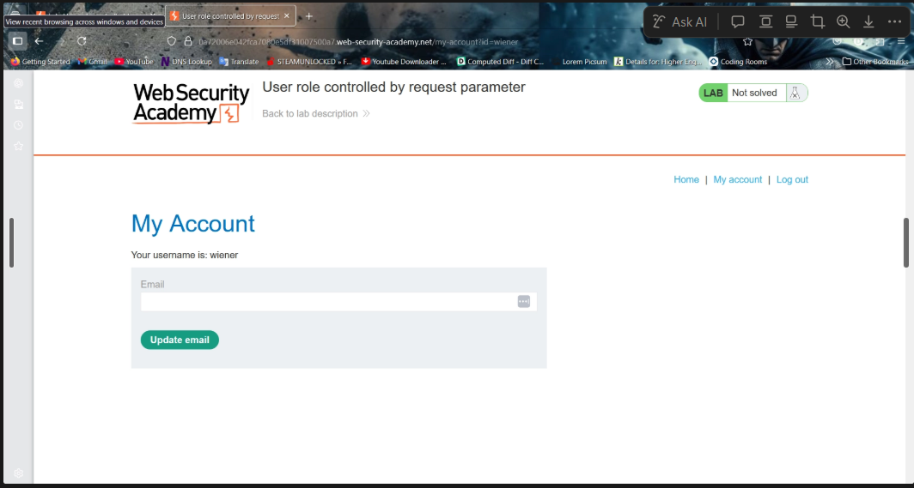
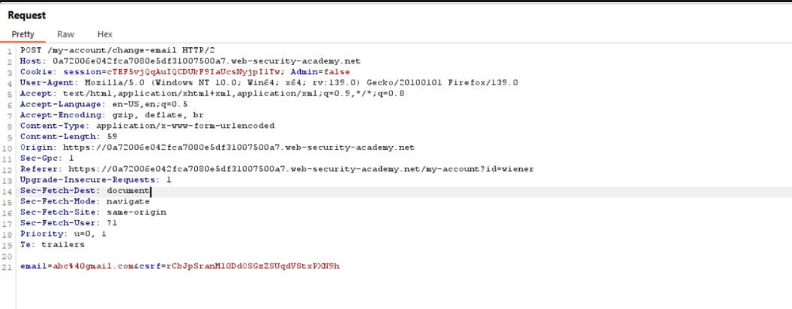
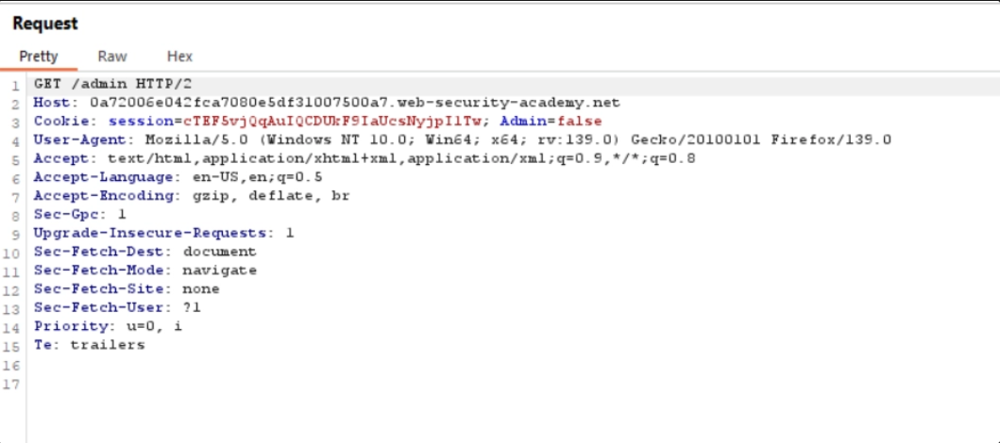
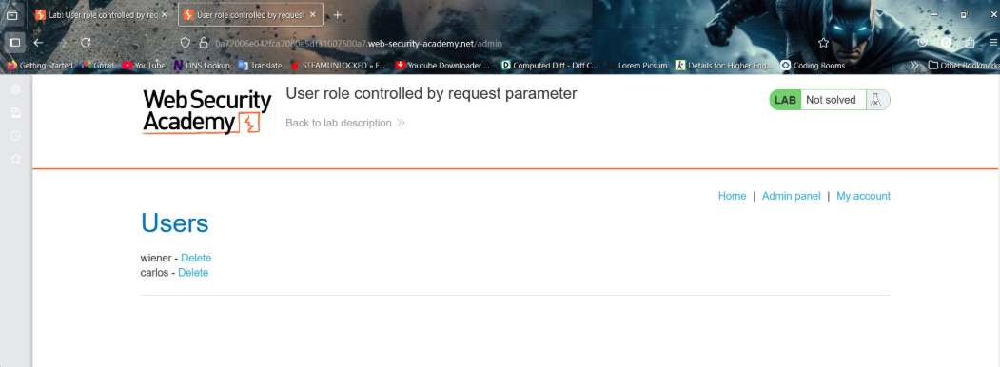
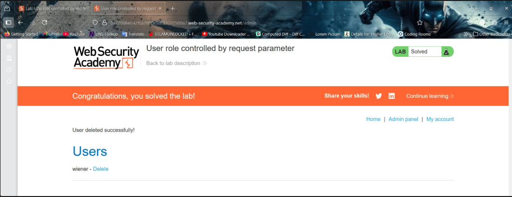

# User Role Controlled by Request Parameter

## Lab Overview

This lab demonstrates a **Broken Access Control** vulnerability where administrator privileges are controlled using a user-controlled request parameter.

The application contains an administrator panel located at:

```bash
/admin
```

However, administrator access is determined using a forgeable parameter that can be manipulated by the user.

The objective of the lab is to:

- Gain administrator access
- Access the administrator panel
- Delete the user `carlos`

Credentials provided by the lab:

```txt
Username: wiener
Password: peter
```

This vulnerability is a classic example of **Vertical Privilege Escalation** caused by trusting client-controlled data.

---

# Understanding the Vulnerability

Applications should never trust:
- Client-side parameters
- User-controlled cookies
- Hidden fields
- Request values

for authorization decisions.

In this lab, the application determines administrative privileges using a parameter similar to:

```txt
Admin=false
```

Because this parameter is controlled by the client, an attacker can modify it to:

```txt
Admin=true
```

and gain unauthorized administrator access.

---

# Step-by-Step Lab Solution

---

# Step 1 — Logging into the Application

Logged into the application using the provided credentials:

```txt
Username: wiener
Password: peter
```

The goal was to escalate privileges and delete the user `carlos`.

---

# Step 2 — Initial Enumeration

Initially attempted common discovery techniques such as:

```bash
/robots.txt
/sitemap.xml
```

However, these did not reveal anything useful.

Additional testing included:
- Removing CSRF tokens
- Direct URL manipulation
- Attempting parameter tampering

---

# Step 3 — Attempting Horizontal Privilege Escalation

Tried modifying the account identifier parameter from:

```txt
/my-account?id=wiener
```

to:

```txt
/my-account?id=carlos
```

However, access was denied and no useful result was obtained.



This indicated that direct account ID tampering was not the vulnerability.

---

# Step 4 — Capturing Requests Using Burp Suite

Requests were intercepted using :contentReference[oaicite:0]{index=0} to analyze application behavior.

Captured the request while updating the email address.



---

# Step 5 — Identifying the Admin Parameter

During request analysis, noticed a parameter similar to:

```txt
Admin=false
```

This revealed that the application was relying on a client-controlled parameter to determine administrative privileges.

---

# Step 6 — Modifying the Request Parameter

Modified the intercepted request parameter from:

```txt
Admin=false
```

to:

```txt
Admin=true
```

and forwarded the request.



The application accepted the modified request.

This confirmed that administrator access was being controlled insecurely through user-controlled parameters.

---

# Step 7 — Accessing the Administrator Panel

After privilege escalation, intercepted the request for:

```bash
/admin
```

Again modified:

```txt
Admin=false
```

to:

```txt
Admin=true
```

and forwarded the request.



The administrator panel became accessible.

---

# Step 8 — Deleting the User Carlos

Inside the administrator panel:
- Selected the delete option for the user `carlos`

The delete endpoint appeared similar to:

```bash
/admin/delete?username=carlos
```

Since access was obtained through parameter tampering, the delete request also required modification.

The intercepted request was again changed from:

```txt
Admin=false
```

to:

```txt
Admin=true
```

After forwarding the request, the user was successfully deleted.



The lab was successfully solved.

---

# Vulnerability Analysis

| Vulnerability | Description |
|---|---|
| Broken Access Control | Application trusts user-controlled authorization data |
| Vertical Privilege Escalation | Normal user gains administrator privileges |
| Parameter Tampering | Authorization controlled using forgeable request parameters |

---

# Why This Vulnerability Occurs

The application incorrectly trusted client-side data for authorization decisions.

Instead of validating permissions on the server side, the application relied on:

```txt
Admin=false
```

provided by the client.

Attackers can easily manipulate such parameters using tools like:
- Burp Suite
- Browser Developer Tools
- Proxy tools

---

# Understanding CSRF Tokens

During request interception, CSRF tokens were also observed in the application requests.

---

# What is a CSRF Token?

CSRF stands for:

```txt
Cross-Site Request Forgery
```

A CSRF token is:
- Unique
- Random
- Unpredictable

and is generated by the server to verify that sensitive requests are legitimate.

---

# Why CSRF Protection is Important

Without CSRF protection:
- Attackers can trick authenticated users into performing unintended actions

The server sees:
- Valid session cookies
- Authenticated requests

but cannot determine whether the request was intentionally initiated by the user.

---

# Example of a CSRF Attack

## Scenario

1. User logs into a banking application
2. Session cookies are stored in the browser
3. Attacker tricks the user into visiting a malicious page
4. The malicious page silently sends a money transfer request
5. Browser automatically includes the victim's session cookies
6. Server processes the request as authenticated

Without CSRF protection, the transfer succeeds.

---

# How CSRF Tokens Prevent Attacks

## Step 1

Server generates:
- Session ID
- CSRF token

and stores them securely.

---

## Step 2

The CSRF token is included in sensitive forms as a hidden value.

Example:

```html
<input type="hidden" name="csrf" value="random-token">
```

---

## Step 3

When the user submits a request:
- The browser sends the CSRF token back to the server

---

## Step 4

The server verifies:
- Token from request
- Token stored in session

If both match:
- Request is accepted

Otherwise:
- Request is rejected

---

# Important Observation

Although CSRF protection existed in this application, the real vulnerability was:

```txt
Broken Access Control
```

The application still trusted user-controlled authorization parameters.

CSRF protection cannot prevent authorization flaws.

---

# Security Risks

Improper authorization can lead to:
- Administrative compromise
- Unauthorized data access
- Privilege escalation
- Full application takeover

---

# Recommended Mitigations

## 1. Never Trust Client-Side Authorization Data

Authorization decisions must always be enforced server-side.

---

## 2. Implement Proper Role Validation

Validate:
- User identity
- User role
- Required permissions

before granting access.

---

## 3. Use Secure Session Management

Store authorization state securely on the server instead of trusting client-controlled parameters.

---

## 4. Perform Regular Security Testing

Test applications for:
- Access control flaws
- Parameter tampering
- Privilege escalation vulnerabilities

---

# Tools Used

- Burp Suite
- Browser Developer Tools
- PortSwigger Web Security Academy

---

# Key Takeaways

- Client-controlled parameters should never determine authorization
- Authorization checks must always be server-side
- CSRF protection does not replace proper access control
- Broken Access Control vulnerabilities can lead to severe compromise

---

# References

- PortSwigger Web Security Academy
- OWASP Broken Access Control
- OWASP CSRF Prevention Cheat Sheet
